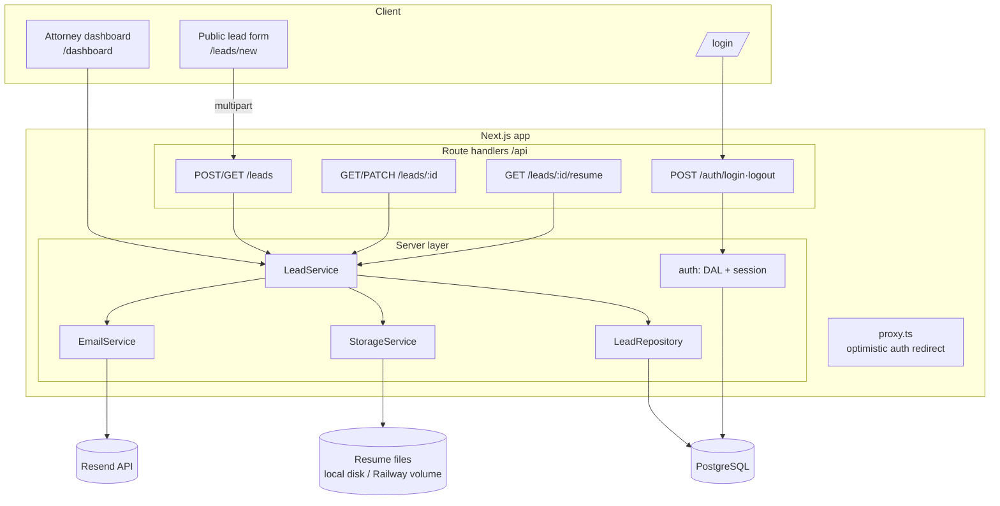
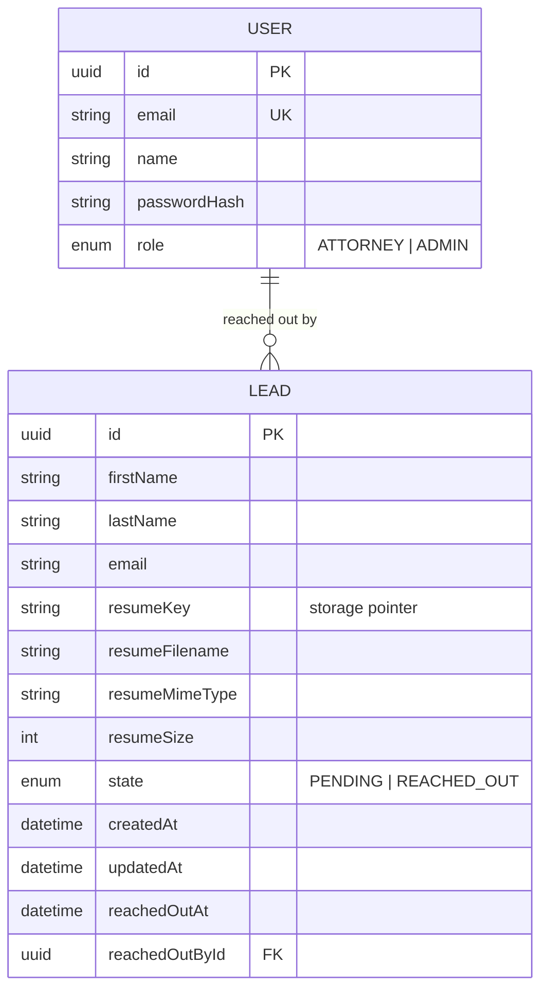
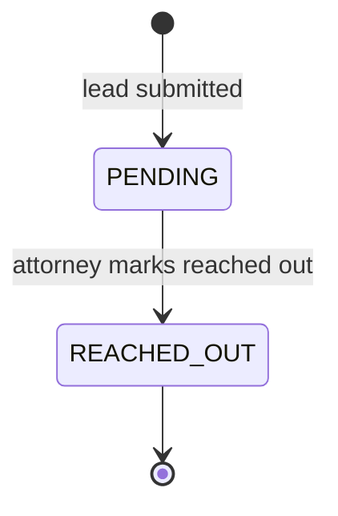
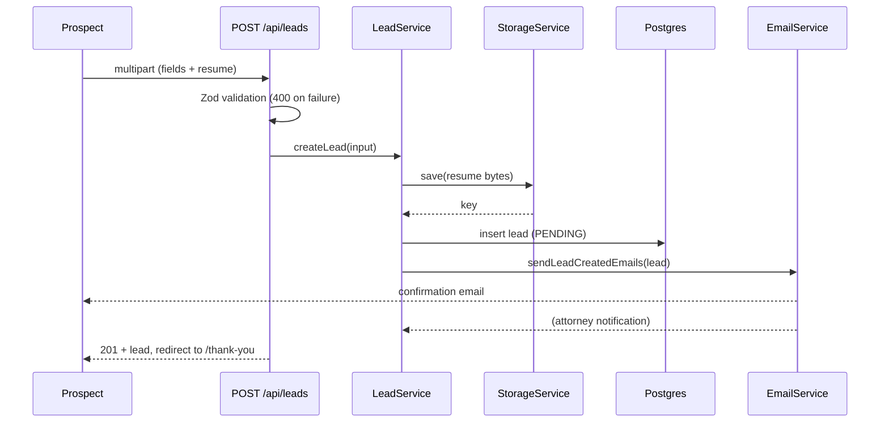

# Design

This document explains **how** the application is built and **why** the main
choices were made. For setup/run instructions see [`README.md`](./README.md);
for coding-agent usage see [`NOTES.md`](./NOTES.md).

## 1. Requirements → where they live

| Requirement                                       | Implementation                                                      |
| ------------------------------------------------- | ------------------------------------------------------------------- |
| Public form: first/last name, email, resume       | `/leads/new` + `POST /api/leads` (no auth)                          |
| Create / get / update leads                       | `LeadService` + REST route handlers                                 |
| On submit, email the prospect **and** an attorney | `EmailService.sendLeadCreatedEmails` (best-effort, both recipients) |
| Internal UI behind auth listing all leads         | `/dashboard` (server component) guarded by the DAL                  |
| State: `PENDING` → `REACHED_OUT`, set manually    | `lead.state.ts` state machine + `PATCH /api/leads/:id`              |
| Persist data + email integration                  | Postgres (Prisma 7) + a `StorageService` for files + Resend         |
| Production-shaped structure                       | Layered server (`route → service → repository`), tests, CI          |

## 2. Architecture

One Next.js app serves the public UI, the authenticated dashboard, and the REST
API. Business logic lives in a framework-agnostic server layer so it is testable
and the data store / email / file backends are swappable.

**Why the dashboard reads the service directly (not its own HTTP API):** in the
App Router, a server component calling `fetch('/api/leads')` would add a
needless internal round trip. Instead the page calls `leadService.listLeads()`
after `requireSessionOrRedirect()`. The REST API still exists for the public
form, the client mutations, and external/automated consumers — and is what the
integration/E2E tests exercise.

## 3. Data model

The DB stores only an opaque `resumeKey`; the bytes live behind the
`StorageService`. `reachedOutAt` / `reachedOutById` form an audit trail for the
state transition.

## 4. API

| Method | Route                   | Auth   | Notes                                 |
| ------ | ----------------------- | ------ | ------------------------------------- |
| POST   | `/api/leads`            | Public | multipart; creates lead, sends emails |
| GET    | `/api/leads`            | Auth   | `?state=` filter                      |
| GET    | `/api/leads/:id`        | Auth   |                                       |
| PATCH  | `/api/leads/:id`        | Auth   | `{ "state": "REACHED_OUT" }`          |
| GET    | `/api/leads/:id/resume` | Auth   | streams the file                      |
| POST   | `/api/auth/login`       | Public | sets the session cookie               |
| POST   | `/api/auth/logout`      | Auth   | clears it                             |

Errors are normalized in one place (`errorToResponse`): Zod → `400` with
field details, `AppError` subclasses carry their status
(`401/403/404/409`), and anything else is a `500` that does not leak internals.

## 5. State machine

`PENDING → REACHED_OUT` is the only legal move; everything else (reverting,
re-reaching-out) is a `409`. The rule lives in `lead.state.ts` and is enforced
by the service, not the route handler.

## 6. Lead submission flow

Emails are sent with `Promise.allSettled` and failures are logged, not thrown:
a transient mail outage must never drop a captured lead. See
[future work](#11-future-work) for the durable-outbox upgrade.

## 7. Key decisions & trade-offs

- **Next.js full-stack (TypeScript).** One codebase and one Railway service for
  the public form, the auth dashboard, and the API; type-safety end to end. The
  cost is coupling UI and API deploys — acceptable at this scale.
- **Prisma 7 + driver adapter.** Type-safe data access and migrations. Prisma 7
  removed the Rust engine, so the client connects via `@prisma/adapter-pg` and
  the connection URL lives in `prisma.config.ts` (not the schema). Generated
  client is gitignored and rebuilt on install/build.
- **Storage abstraction, local/volume default.** The DB holds a key; bytes go
  through a `StorageService`. Default is disk (a Railway volume in prod); an S3
  provider can drop in behind the same interface with no caller changes. This
  keeps everything on Railway while staying production-shaped.
- **Lightweight JWT session (jose) over a heavy auth library.** A signed,
  httpOnly cookie + bcrypt is transparent, easy to test, and dependency-light.
  The real boundary is the **DAL** (`requireSession*`) checked next to the data;
  `proxy.ts` only does optimistic redirects (per Next.js guidance).
- **Resend with a console fallback.** Real provider in prod; when
  `RESEND_API_KEY` is unset, emails are logged so the app runs locally with zero
  email setup.
- **Layered server (route → service → repository).** Route handlers stay thin;
  business rules and the state machine live in the service; Prisma is isolated
  in the repository behind an interface, which is what makes the unit tests fast
  and the integration tests meaningful.

## 8. Security

- Public endpoint is intentionally unauthenticated; all read/update endpoints
  require a verified session, checked in the DAL close to the data (route
  handlers and the dashboard page), not only in `proxy.ts`.
- Passwords are bcrypt-hashed; login returns the same error for unknown email
  and wrong password and does a dummy compare to blunt user-enumeration timing.
- Session cookie is httpOnly, `sameSite=lax`, and `Secure` in production.
- Inputs are validated with Zod (including file type/size); user values are
  HTML-escaped in emails; generated storage keys avoid path traversal.

## 9. Testing

- **Unit (Vitest):** state machine, schemas, error mapping, session round-trip,
  and `LeadService` with in-memory fakes (the DI seams).
- **Integration (Vitest + live Postgres):** real repository + on-disk storage
  for the lead lifecycle, and real login.
- **E2E (Playwright):** submit → thank-you, login, dashboard mark-reached-out,
  and the auth redirect.
- **CI (GitHub Actions):** Postgres service container; lint + typecheck + tests,
  with a separate Chromium E2E job.

## 10. Deployment (Railway)

The app deploys as **one service** + a **Postgres** plugin + a **volume** for
resume files. `railway.json` pins the build/start and runs
`prisma migrate deploy` before each release.

1. **Postgres:** add the Railway PostgreSQL plugin.
2. **App service:** deploy this GitHub repo. Build is `npm run build`
   (`prisma generate` + `next build`); `railway.json` runs
   `prisma migrate deploy` as the pre-deploy step and starts with
   `npm run start` (Next reads Railway's `PORT`).
3. **Volume:** attach a volume to the app service mounted at `/data` and set
   `STORAGE_LOCAL_DIR=/data/uploads`.
4. **Environment variables** (app service):
   `DATABASE_URL=${{Postgres.DATABASE_URL}}`, `SESSION_SECRET` (e.g.
   `openssl rand -base64 32`), `STORAGE_DRIVER=local`,
   `STORAGE_LOCAL_DIR=/data/uploads`, `RESEND_API_KEY`, `EMAIL_FROM`,
   `ATTORNEY_NOTIFY_EMAIL`, and `NEXT_PUBLIC_APP_URL`.
5. **Public URL:** generate a domain, then set `NEXT_PUBLIC_APP_URL` to it and
   redeploy (it is baked in at build time, so it must be set before the build
   that ships).
6. **Resend:** verify a sending domain for delivery to arbitrary addresses; the
   `onboarding@resend.dev` sender only reaches your own account email.

## 11. Future work

- **Durable email outbox.** Persist an outbox row and dispatch via a worker/queue
  so emails survive crashes and get retries (today they are best-effort inline).
- **S3/R2 storage provider** for horizontal scaling and signed download URLs.
- **Pagination & search** on the dashboard for large lead volumes.
- **Richer roles/permissions** and per-attorney assignment.
- **Rate limiting / spam protection** on the public endpoint (e.g. captcha).
